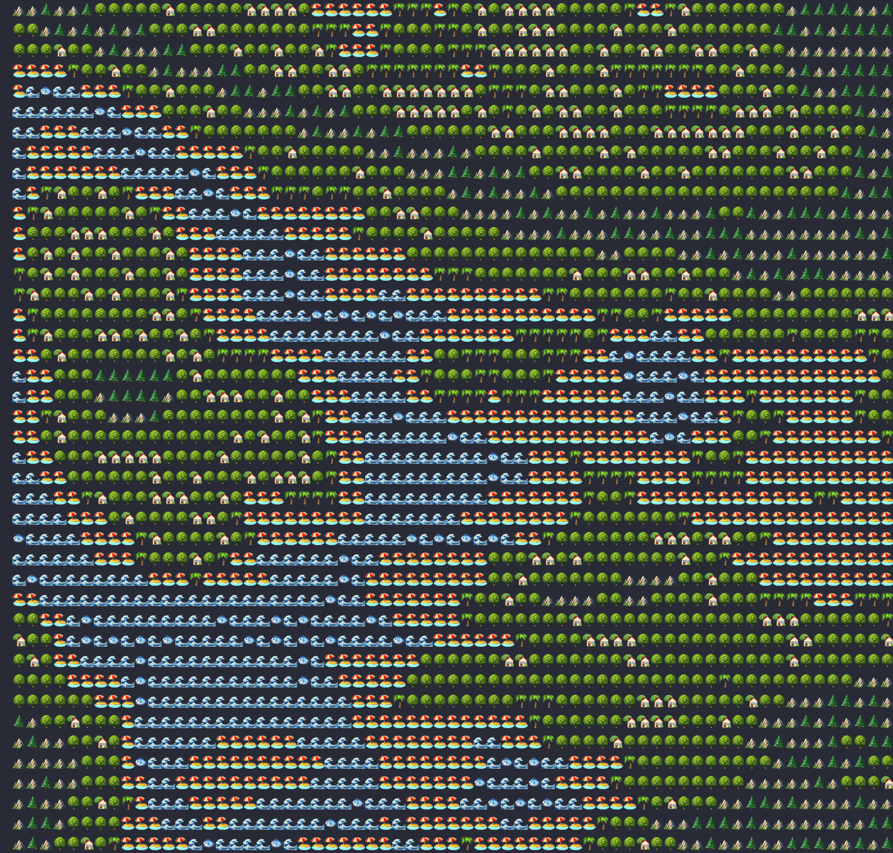

<h1 align="center">Emoji Land</h1>

Python script to generate emoji lands based on noise levels

## 📺 Demo

#### Noise Level 100

## 🛠 Built With

- Python3
- noise
- termcolor

## 🤝 Support

Give a ⭐️ if you like this project!
